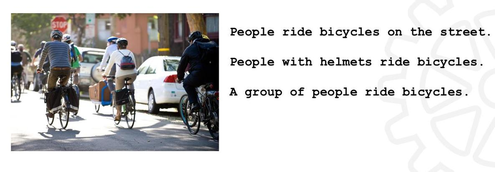

# ImageCaptioning
Generating image descriptions using deep learning (CNN, RNN)

# About the project

This was a final project for [PSIML2018](http://psiml.petnica.rs/) organised by [Microsoft Development Center Serbia](https://www.microsoft.com/sr-latn-rs/mdcs). The idea is to describe images based on its content using neural neutworks (convolutional + recurrent).

# Problem to solve

The system should try to give possible description given an image as showed on Figure 1. 
Questions that should be answered: 
- What kind of architecture we need?
- Which part of the image affect which word in the output?

   

Figure 1: Possible explanations of the image

# Data

Data for this project is found in MSCOCO dataset from this [link](http://cocodataset.org/#download).

# Solution

Solution to this problem is found in paper [Show and Tell: A Neural Image Caption Generator](https://arxiv.org/abs/1411.4555). 
Architecture that is proposed in this paper (Figure 2) contains Convolutional Neural Network (marked as DNN) which extracts features from images. These features now represent input to RNN (LSTM) together with embeddings of the words that describe the particular image. This basic architecture is presented on the Figure 2. Code for this implementation is in folder **basic_architecture**.  

   

Figure 2: Architecture from Show and Tell paper

Even though mentioned architecture produces solid results and images are quite well described, there is no intuition on which parts of the word are affected by which part of the image. So, the next paper to read is [Show, Attend and Tell: Neural Image Caption Generator with Visual Attention](https://arxiv.org/abs/1502.03044). This new architecture is slightly different, but the most important difference is that features are not directly connected to LSTM. After getting features of the image, they are transfered to attention neural network which tries to explore the context of the image and to make unique representation of it. This context is than merged with word embeddings and as that, directed to LSTM. This is presented on the Figure 3.
This implementation is done in directory **attention_architecture**.

   

Figure 3: Show, Attend and Tell architecture

## Results

Here are some of the results after both models were trained. Red flag marks bad examples, and blue flag represents the good ones.

**Basic model**

   

Figure 4: Basic model - Bad example num 1

   

Figure 5: Basic model - Good example num 1

   

Figure 6: Basic model - Bad example num 4

   

Figure 7: Basic model - Good example num 2

   

Figure 8: Basic model - Good example num 3

**Attention model**

   

Figure 9: Attention model - Good example num 1

   

Figure 10: Attention model - Bad example num 1

   

Figure 11: Attention model - Good example num 2

   

Figure 12: Attention model - Good example num 3

At the end, I would like to mention that this code is not written from scratch, some parts are found on the internet and adjusted for this specific project.

